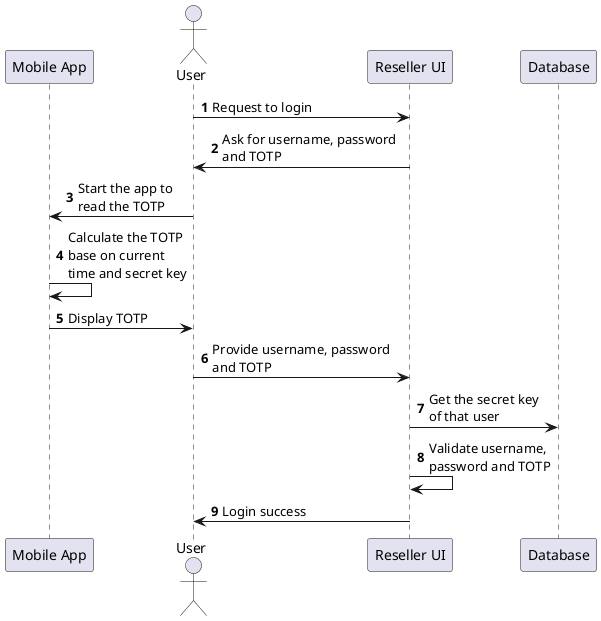
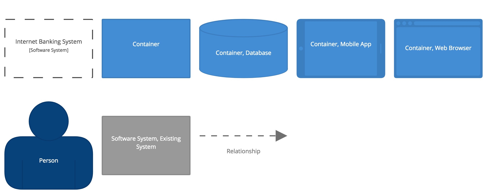

<!-- markdownlint-disable MD033 MD026 -->


# Nodes PlantUML Resources <!-- omit in toc -->
This repo is aimed at providing documentation, resources, themes and other files related to creating diagrams using PlantUML at Nodes. 
<br><br>
Over time more useful good practices, workflow recommendations and new tools will be added, but feel free to open a PR if you have ideas for improvements.

## Contents <!-- omit in toc -->

- [What is PlantUML?](#what-is-plantuml)
- [Getting Started](#getting-started)
  - [Installation](#installation)
  - [Usage](#usage)
- [Recommended Tools & Worfklow](#recommended-tools--worfklow)
- [Themes](#themes)
  - [Applying a theme](#applying-a-theme)
- [C4 and PlantUML](#c4-and-plantuml)
- [Credits](#credits)
  - [Authors](#authors)
- [License](#license)

## What is PlantUML?

[PlantUML](http://plantuml.com) is an open-source tool allowing users to create UML diagrams from a plain text language. The language of PlantUML is an example of a Domain-specific language. It uses Graphviz software to lay out its diagrams.

*An example of a basic sequence diagram:*


*Code used to generate the above diagram:*



## Getting Started

If you have no experience with PlantUML, then start by checking out the [official website](http://plantuml.com) which provides the full documentation, latest releases and a handy online tool to generate diagrams from your PlantUML code.

We also recommend checking out the following:

- [Reference Guide](http://plantuml.com/guide) - a PDF file containing the reference guide for PlantUML.
- [Online Demo Server](http://www.plantuml.com/plantuml/) - useful to prototype diagrams on the fly or quickly host diagrams online.
- [Real World PlantUML](https://real-world-plantuml.com) - contains examples of real world usecases and can be source of inspiration.
- [Official Github](https://github.com/plantuml/plantuml) - useful if you want to see how is PlantUML implemented or if you want to contribute.

### Installation

The recommended way to install PlantUML is through [Homebrew](https://brew.sh).

```bash
brew install plantuml
```

> Other installation options are listed on PlantUML website [here](http://plantuml.com/starting).

### Usage

After you have succesfully installed PlantUML you can start using it. 

1. First, create a `.puml` file that contains your PlantUML code or the sample below

   ```plantuml
   @startuml
   Alice -> Bob: test
   @enduml
   ```

2. Then use the PlantUML command line tool to generate a `.png` file containing your diagram

   ```bash
   plantuml Diagram.puml
   ```

## Recommended Tools & Worfklow

Although generating diagrams using the command line works fine, it is not the ideal workflow when actively working and iterating on a diagram. For this reason we recommend using the following tools and plugins.

- [Visual Studio Code](https://code.visualstudio.com/) - very popular code editor with lots of extensions available.
- [PlantUML extension](https://marketplace.visualstudio.com/items?itemName=jebbs.plantuml) - extension that adds full support for PlantUML including live reload and autocompletion.

> You are free to use whatever code editor and extensions you want, however these tools have been tested and confirmed working with all the resources located in this repository.

## Themes

Themes provide some basic styling for your diagrams, so that they are more aligned with Nodes branding and they look more "up-to-date". Some elements might not be styled and we would welcome any PRs or recommendations for components that are missing styling.

To check which themes are available, please check the contents of the `themes/` directory in this repository.

### Applying a theme

In your PlantUML file add the following line right after the `@startuml` tag.

```plantuml
!include https://raw.githubusercontent.com/nodesagency/plantuml-resources/master/themes/THEME_NAME.iuml
```

So if choosing the `NodesTheme`, then your `.puml` file should look similar to the code below

```plantuml
@startuml
!include https://raw.githubusercontent.com/nodesagency/plantuml-resources/master/themes/NodesTheme.iuml

...
YOUR PUML CODE
...

@enduml
```

## C4 and PlantUML

At Nodes we use the C4 model for defining solution architecture and PlantUML can be used to generate C4 compatible diagrams.  

**You can find more information on how to do C4 diagrams using PlantUML in a separate document [here](./docs/C4.md).**



## Credits

Made with ❤️ at Nodes.

### Authors

| [](https://linkedin.com/in/dominikhadl) 	|
|:---------------------------------------------------------------------------------------------------------:	|
|                                            **Dominik Hádl**                                            	|

## License

All files in this repository are released under the MIT license. See [LICENSE](./LICENSE) for details.
