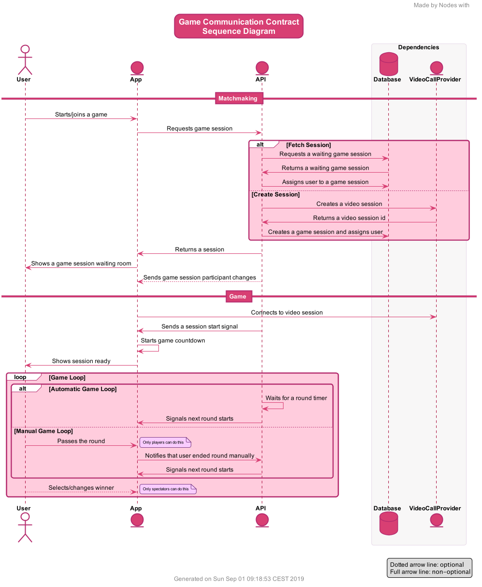
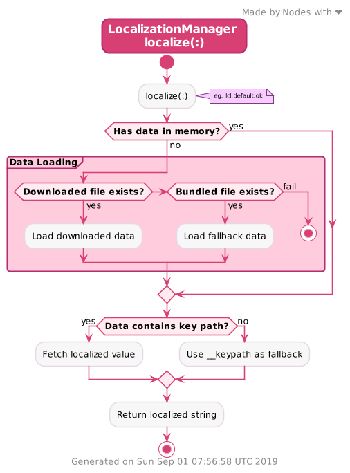

<!-- markdownlint-disable MD024 -->

# List of themes <!-- omit in toc -->

Below you can find a list of currently available PlantUML themes created by Nodes:

- [Nodes (NodesTheme.iuml)](#nodes-nodesthemeiuml)
- [Nodes Dark (NodesDarkTheme.iuml)](#nodes-dark-nodesdarkthemeiuml)
- [Examples Source Code](#examples-source-code)
  - [Sequence](#sequence)
  - [Activity](#activity)

This table shows which types of diagrams were implemented in each theme to save you time when choosing a theme for your diagram. 

| Diagram / Theme    | Sequence | Usecase | Class | Activity | Component | State | Object | Deployment | Timing |
|--------------------|----------|---------|-------|----------|-----------|-------|--------|------------|--------|
| Nodes      |     ✅    |    ❌    |   ❌   |     ✅    |     ❌     |   ❌   |    ❌   |      ❌     |    ❌   |
| Nodes Dark |     ❌    |    ❌    |   ❌   |     ❌    |     ❌     |   ❌   |    ❌   |      ❌     |    ❌   |

> When you see an ❌ it means that no one simply had enough time to implement it, but it's not difficult and we would really appreciate PRs.

## Nodes (NodesTheme.iuml)

This is the classic Nodes theme that should be good to use in most situations. 

### Usage <!-- omit in toc -->

```plantuml
!include https://raw.githubusercontent.com/nodesagency/plantuml-resources/master/themes/NodesTheme.iuml
```

### Example <!-- omit in toc -->

This section contains examples using the Nodes theme.

#### Sequence <!-- omit in toc -->

An sequence diagram using the Nodes theme.



#### Activity <!-- omit in toc -->

An activity diagram using the Nodes theme.



## Nodes Dark (NodesDarkTheme.iuml)

> **⚠️ Work on this theme hasn't started yet, any PRs are welcome.**

A variant of the Nodes Default theme, that uses dark colors that can be softer on the eye.

### Usage <!-- omit in toc -->

```plantuml
!include https://raw.githubusercontent.com/nodesagency/plantuml-resources/master/themes/NodesDarkTheme.iuml
```

## Examples Source Code

### Sequence

```plantuml
@startuml
!include https://raw.githubusercontent.com/nodesagency/plantuml-resources/master/themes/NodesTheme.iuml

title
Game Communication Contract
Sequence Diagram
end title

actortitle
Game Communication Contract
Sequence Diagram
end title

actor User
entity App
entity API

box Dependencies
    database Database
    entity VideoCallProvider
end box

== Matchmaking ==

User -> App : Starts/joins a game
App -> API : Requests game session
alt Fetch Session
API -> Database : Requests a waiting game session
Database -> API : Returns a waiting game session
API -> Database : Assigns user to a game session
else Create Session
API -> VideoCallProvider : Creates a video session
VideoCallProvider -> API : Returns a video session id
API -> Database : Creates a game session and assigns user
end
API -> App : Returns a session
App -> User : Shows a game session waiting room
API --> App : Sends game session participant changes

== Game ==

App -> VideoCallProvider : Connects to video session
API -> App : Sends a session start signal
App -> App : Starts game countdown
App -> User : Shows session ready
loop Game Loop
    alt Automatic Game Loop
        API -> API : Waits for a round timer
        API -> App : Signals next round starts
    else Manual Game Loop
        User -> App : Passes the round
        note right: Only players can do this
        App -> API : Notifies that user ended round manually
        API -> App : Signals next round starts
    end
    User --> App : Selects/changes winner
    note right : Only spectators can do this
end

legend right
    Dotted arrow line: ""optional""
    Full arrow line: ""non-optional""
endlegend

@enduml
```

### Activity

```plantuml
@startuml
!include https://raw.githubusercontent.com/nodesagency/plantuml-resources/master/themes/NodesTheme.iuml

title 
LocalizationManager 
""localize(:)""
end title

' =========================

start
:localize(:);
note right: eg. ""lcl.default.ok""

'  == Loading Localization

if (Has data in memory?) then (no)
  partition "Data Loading" {
    if (Downloaded file exists?) then (yes)
      :Load downloaded data;
    elseif (Bundled file exists?) then (yes)
      :Load fallback data;
    else (fail)
      stop
    endif
  }
else (yes)
endif

'  == Loading value

if (Data contains key path?) then (yes)
	  :Fetch localized value;
	else (no)
	  :Use ""__keypath"" as fallback;
	endif
:Return localized ""string"";
stop

' =========================

@enduml
```
